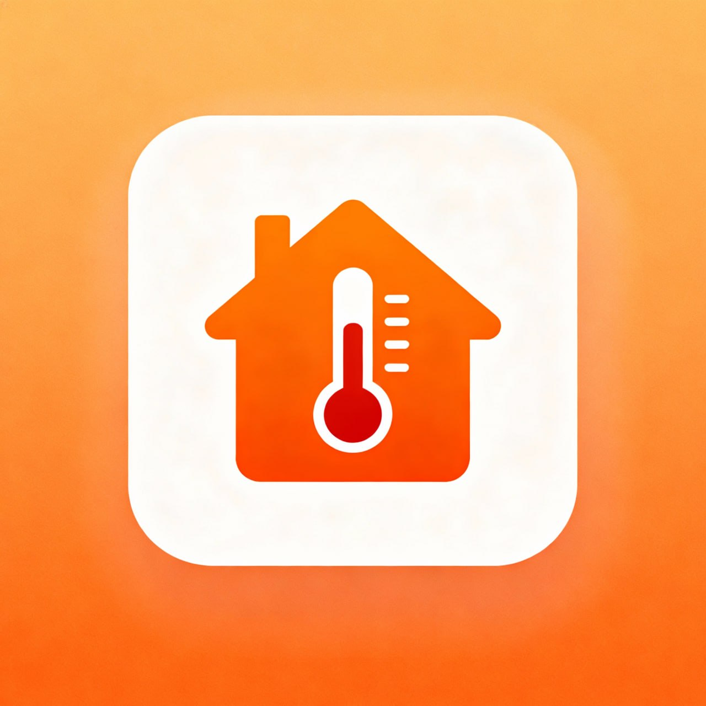

# Chauffly - Smart Heating Control App

<div align="center">
  
  
  **Contrôle intelligent du chauffage**
  
  A modern Flutter application for smart spa/hot tub temperature control with an elegant, minimalist design.
</div>

---

## 📱 About

Chauffly is a smart heating control application designed for managing spa and hot tub temperatures. The app features a clean, intuitive interface with real-time temperature monitoring, intelligent controls, and automated scheduling capabilities.

## ✨ Features

### 🎨 Modern UI/UX
- **Elegant Design**: Beige/cream color scheme with red accents
- **Animated Splash Screen**: Smooth loading animation with 4.5-second display
- **Responsive Layout**: Optimized for various screen sizes
- **Glowing Indicators**: Visual feedback for connection status

### 🌡️ Temperature Control
- **Real-time Display**: Large, easy-to-read temperature display (15-30°C range)
- **Interactive Slider**: Smooth temperature adjustment
- **Target Temperature**: Set and monitor desired temperature
- **Visual Feedback**: Clear current vs. target temperature indicators

### 🎛️ Smart Controls
- **Power Toggle**: ON/OFF control with visual feedback
- **Automatic Mode**: Enable intelligent temperature management
- **Connection Status**: Real-time connection indicator
  - Green glowing light when connected (power ON)
  - Gray indicator when disconnected (power OFF)

### 📊 Monitoring
- **Humidity Tracking**: Monitor current humidity levels
- **Energy Usage**: Track power consumption in kWh
- **Session Counter**: View daily usage sessions
- **Temperature Range**: Visual min/max temperature display

---

## 🚀 Getting Started

### Prerequisites

- Flutter SDK (^3.8.1 or higher)
- Dart SDK
- Android Studio / Xcode (for mobile development)
- A physical device or emulator

### Installation

1. **Clone the repository**
   ```bash
   git clone <repository-url>
   cd shofly_v
   ```

2. **Install dependencies**
   ```bash
   flutter pub get
   ```

3. **Run the app**
   ```bash
   flutter run
   ```

### Building for Production

**Android:**
```bash
flutter build apk --release
```

**iOS:**
```bash
flutter build ios --release
```

---

## 📂 Project Structure

```
shofly_v/
├── lib/
│   ├── main.dart                          # App entry point
│   └── screens/
│       ├── splash_screen.dart             # Animated splash screen (4.5s)
│       ├── intro_screen.dart              # Onboarding screen (unused)
│       └── temperature_control_screen.dart # Main control interface
├── assets/
│   └── LOGO.jpg                           # App logo
├── android/                               # Android platform files
├── ios/                                   # iOS platform files
├── pubspec.yaml                           # Dependencies & configuration
└── README.md                              # This file
```

---

## 🎨 Design Specifications

### Color Palette
- **Background**: `#F5EFE7` (Beige/Cream)
- **Primary Accent**: `#E63946` (Red)
- **Secondary Accent**: `#FF6B35` (Orange)
- **Connection Indicator**: `#00FF88` (Neon Green)
- **Dark Elements**: `#1A1A1A` (Near Black)

### Typography
- **Title**: 48px, Bold
- **Temperature Display**: 72px, Bold
- **Body Text**: 16-18px, Medium/Regular

---

## 🔧 Configuration

### Assets
The app uses local assets defined in `pubspec.yaml`:
```yaml
assets:
  - assets/
```

### Dependencies
- `flutter` - Core framework
- `cupertino_icons: ^1.0.8` - iOS-style icons

### Dev Dependencies
- `flutter_test` - Testing framework
- `flutter_lints: ^5.0.0` - Code quality & linting

---

## 📱 Screens

### 1. Splash Screen
- Displays app logo and branding
- Animated orange loading bar
- 4.5-second duration
- Auto-navigates to main screen

### 2. Temperature Control Screen
- Real-time temperature display
- Interactive temperature slider
- Power and automatic mode toggles
- Connection status indicator
- Clean, minimal interface

---

## 🛠️ Development

### Running Tests
```bash
flutter test
```

### Code Analysis
```bash
flutter analyze
```

### Format Code
```bash
flutter format .
```

---

## 📋 Features Roadmap

- [ ] Backend API integration
- [ ] Real-time device connectivity
- [ ] Push notifications for temperature alerts
- [ ] Historical data tracking & analytics
- [ ] Multi-device support
- [ ] User authentication
- [ ] Cloud sync for settings
- [ ] Smart scheduling with AI optimization
- [ ] Energy consumption reports
- [ ] Multi-language support

---

## 🤝 Contributing

Contributions are welcome! Please follow these steps:

1. Fork the repository
2. Create a feature branch (`git checkout -b feature/AmazingFeature`)
3. Commit your changes (`git commit -m 'Add some AmazingFeature'`)
4. Push to the branch (`git push origin feature/AmazingFeature`)
5. Open a Pull Request

---

## 📄 License

This project is licensed under the MIT License - see the LICENSE file for details.

---

## 👨‍💻 Author

**Chauffly Development Team**

---

## 🙏 Acknowledgments

- Flutter team for the amazing framework
- Design inspiration from modern smart home applications
- Community contributors and testers

---

## 📞 Support

For support, please open an issue in the repository or contact the development team.

---

<div align="center">
  Made with ❤️ using Flutter
  
  **Chauffly** - Smart Heating Control
</div>
